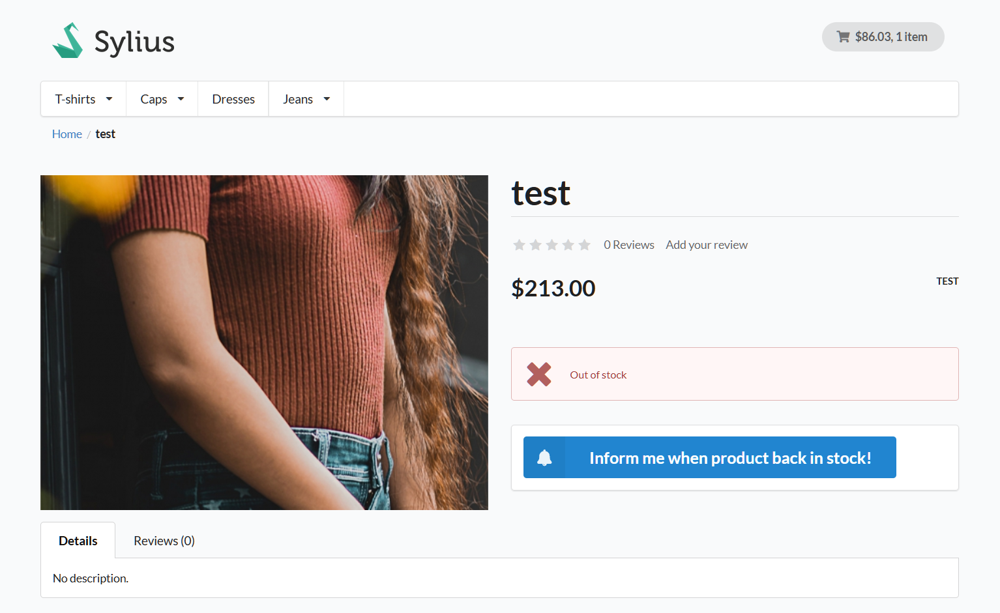
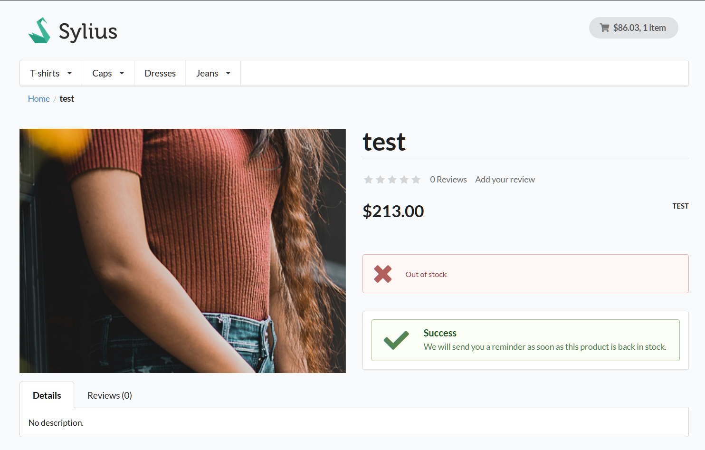
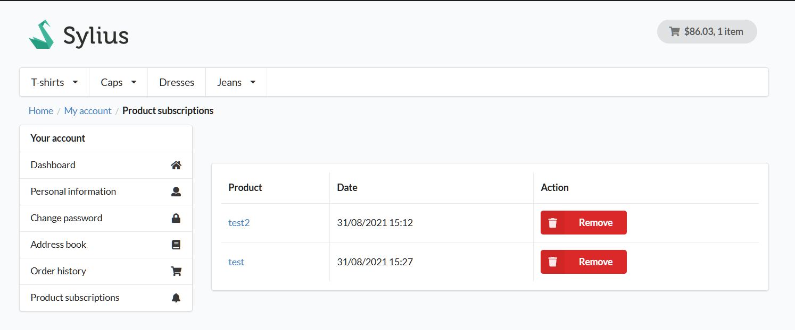
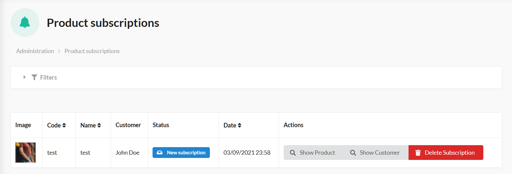

<p align="center">
    <a href="https://sylius.com" target="_blank">
        
    </a>
</p>

<h1 align="center">Sylius Product Subscriptions Plugin</h1>

<p align="center">Plugin that add the possibility to receive an email notification when a product return in stock</p>

## Features

### Subscribe to get a Notification when a product return in stock




### View your subscriptions in the apposite section of your account



### View your client subscriptions in the apposite admin section



## Requirements

* PHP `^7.4`
* Sylius `~1.8.0`

## Installation

1. Run `composer require tavy315/sylius-product-subscriptions-plugin`.

2. Add the plugin to the `config/bundles.php` file:

```php
Tavy315\SyliusProductSubscriptionsPlugin\Tavy315SyliusProductSubscriptionsPlugin::class => ['all' => true],
```

3. Import the plugin routes by creating a file in `config/routes/tavy315_sylius_product_subscriptions_plugin.yaml` with the following content:

```yaml
tavy315_sylius_product_subscriptions_plugin:
  resource: "@Tavy315SyliusProductSubscriptionsPlugin/Resources/config/routing.yaml"
```

4. Import required config in your `config/packages/tavy315_sylius_product_subscriptions_plugin.yaml` file:

```yaml
imports:
   - { resource: "@Tavy315SyliusProductSubscriptionsPlugin/Resources/config/app/config.yaml" }
```

5. Finish the installation by updating the database schema and installing assets:

```bash
bin/console doctrine:migrations:diff
bin/console doctrine:migrations:migrate
bin/console assets:install
bin/console sylius:theme:assets:install
```
